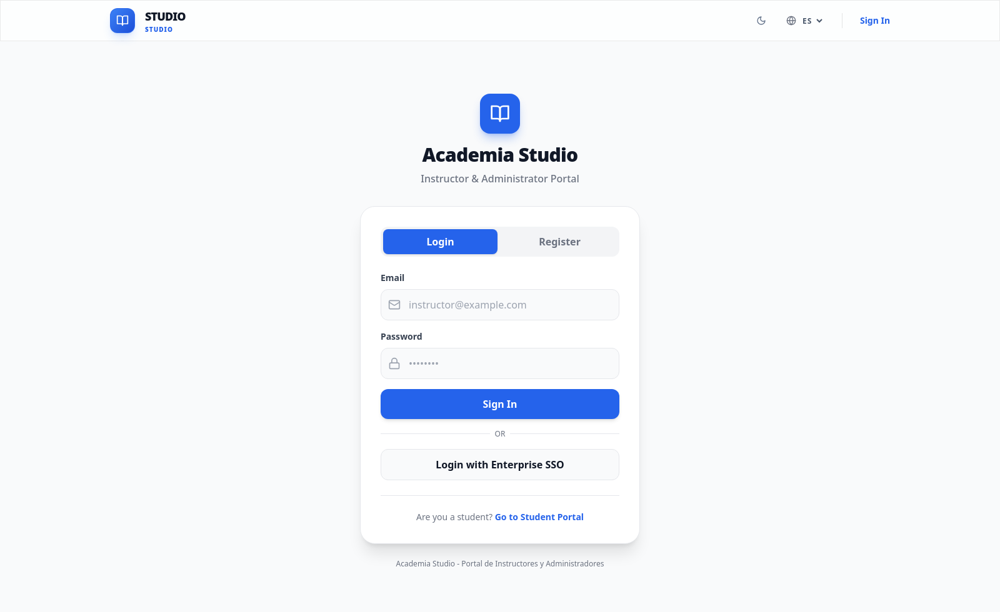
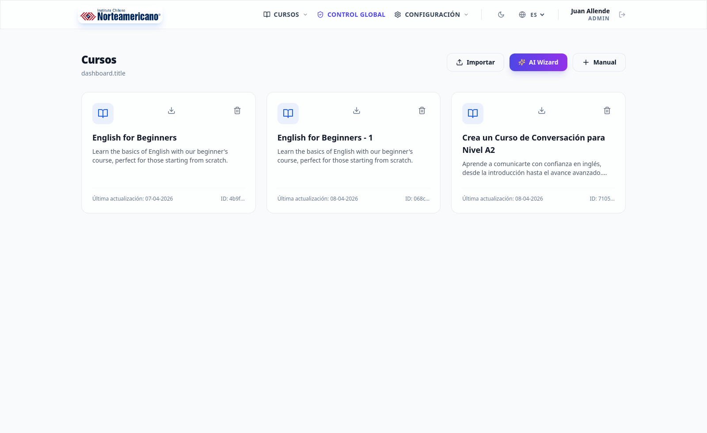
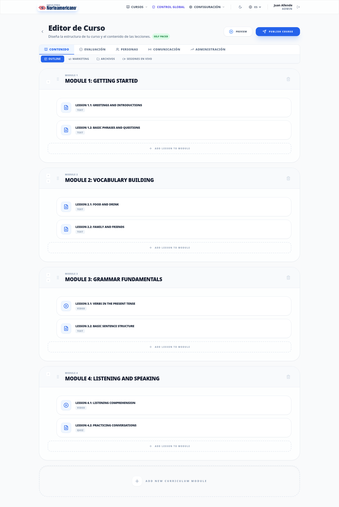
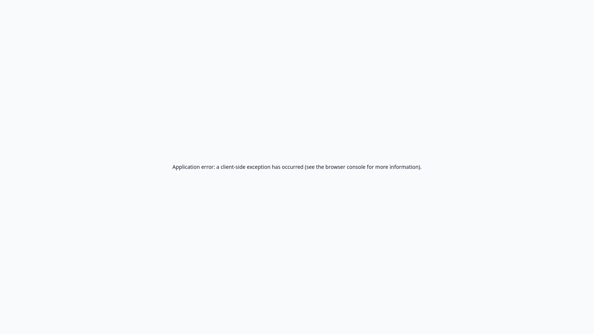
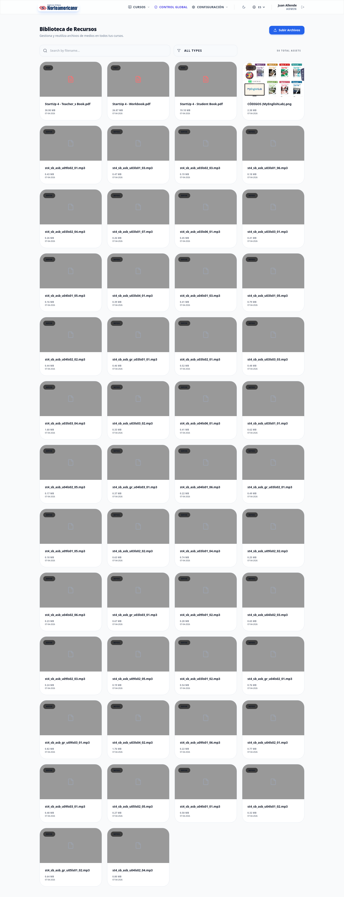
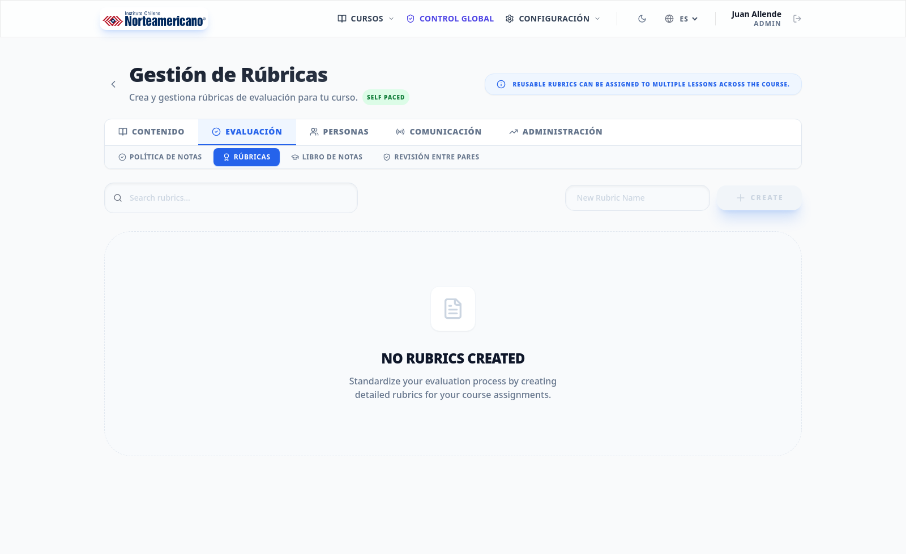
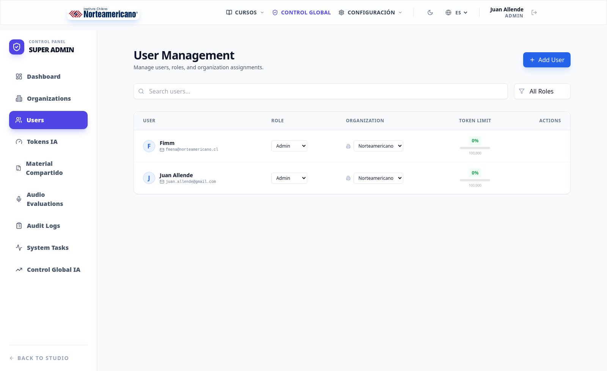

# Brochure Comercial - Plataforma Studio

## 1) Qué es Studio
Studio es la plataforma de autoría académica de OpenCCB para diseñar, publicar y administrar cursos de alta fidelidad. Está orientada a instituciones educativas, equipos académicos y docentes que necesitan construir experiencias de aprendizaje interactivas sin fricción técnica.

## 2) Propuesta de valor
- Diseño instruccional en un entorno moderno y visual.
- Creación de lecciones modulares con bloques interactivos.
- Banco de preguntas reutilizable para evaluaciones.
- Gestión de usuarios, cursos y configuraciones institucionales.
- Integración con LMS Experience para consumo de contenidos por estudiantes.

## 3) Capacidades principales
- Gestión de cursos: creación, edición, estructura por módulos y lecciones.
- Constructor de lecciones: bloques de texto, multimedia, quiz, respuestas cortas, ordenamiento, matching, hotspot, audio-response, peer review, role-playing y mermaid.
- Plantillas: plantillas de curso y de pruebas para estandarizar procesos.
- Biblioteca de assets: administración y reutilización de recursos multimedia.
- Banco de preguntas: catálogo de preguntas filtrable por tipo y dificultad.
- Analítica y seguimiento: soporte para revisión de progreso y evaluaciones.
- Branding institucional: logo, favicon y colores de marca.

## 4) Beneficios para la institución
- Reduce tiempos de producción académica.
- Estandariza calidad de contenidos.
- Facilita colaboración entre docentes y equipos de diseño instruccional.
- Mejora la trazabilidad de evaluaciones y resultados.
- Acelera despliegues de nuevos programas y cursos.

## 5) Flujo recomendado de uso
1. Configurar branding institucional.
2. Crear curso y definir módulos.
3. Diseñar lecciones con bloques interactivos.
4. Configurar evaluaciones y rúbricas.
5. Publicar y monitorear desempeño.

## 6) Capturas sugeridas (fotos)
Pantalla de acceso

Vista principal de cursos

Editor de lección con bloques

Banco de preguntas y filtros

Librería de recursos

Editor de rúbricas

Administración de usuarios

## 7) Mensaje comercial breve
Studio convierte el diseño académico en un proceso más rápido, controlado y escalable. Permite a la institución pasar de la idea al curso publicado con calidad pedagógica y consistencia operacional.
